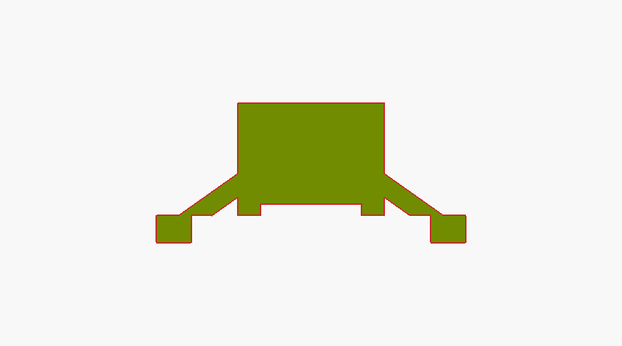

# Silicone nub button

A replacement for the little silicone button that sits over a pair of
interleaved PCB traces: press the nub, the thin web collapses, and the carbon
pill underneath shorts the traces.



All the sizes in `silicone_button.scad` are guesses from photos. Before
printing anything, measure the old button with calipers and fix the
**Measure these** block. The numbers that matter most are `flange_od`,
`plunger_d`, `total_h` and `travel`. `web_t` sets how stiff the button feels.

## Two ways to make one

**1. Cast it in a printed mold (recommended).** The web is about 0.25 mm thick.
That is thinner than an FDM nozzle can lay down, so print the mold instead and
pour the silicone into it:

```
openscad -D 'part="mold_core"'   -o mold_core.stl   silicone_button.scad
openscad -D 'part="mold_cavity"' -o mold_cavity.stl silicone_button.scad
```

- A resin printer gets the most detail out of a mold this small. On FDM, use a
  0.2 mm nozzle and 0.05 mm layers, and expect to clean it up.
- Cure the resin mold all the way through, then give it a coat of clear spray.
  Platinum-cure silicone won't set against uncured resin. Tin-cure silicone
  doesn't have this problem.
- Use a soft silicone around 30A (for example Smooth-On Mold Star 30 or Dragon
  Skin 30). Degas it if you can, then push it in through the sprue with a
  syringe until it comes out of the vents.
- For the contact: peel the carbon pill off the dead button and glue it into
  the recess with silicone adhesive. Or dab conductive carbon paint (sold as
  remote-control keypad repair kits) into the recess after demolding.

**2. Print it directly.** `part="button"` gives the button itself. This only
works on a resin printer with a flexible resin (Elastic 50A or similar). If you
go this way, raise `web_t` to about 0.4 mm so the web survives printing and
washing. FDM TPU at this size will just make a blob.

`scale_factor = 3` prints a big version so you can check the shape before
committing to the real size.
